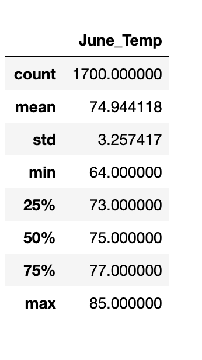
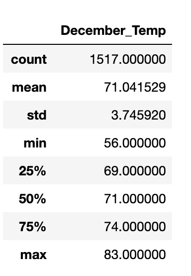
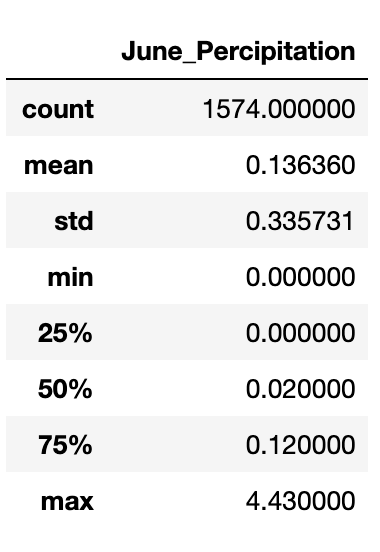
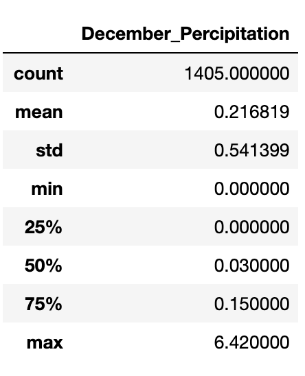

# Surfs_up

Module 9 

# PURPOSE OF ANALYSIS 

I want to open a business in Oahu, Hawaii called Surf n’ Shake Shop, a business that sells  surfboards and ice cream. 
However, I need an investor to make this happen. A potential investor is  W. Avey, but he has invested in a surf shop before, and it ended poorly due to circumstances of weather. So he has asked me to do a Weather analysis of Oahu to inform his decision. 

W. Avy is concerned about the amount of precipitation on Oahu. There needs to be enough rain to keep everything green, but not so much that you lose out on that ideal surfing and ice cream weather.

By analyzing the last 12 months precipitation levels loaded into my SQLite database, we wanted to show that the data backs up the hypothesis that Oahu is the perfect place to surf. 

We used August 23, 2017 because it's the anniversary of the first time he ever went surfing and had ice cream on the same day.

Get a visual understanding of trends in the data, we then created a plot of precipitation scores in chronological order. Rather than simply showing Avey whether it rained on a given day, we showed him how much it rained and if it was raining on the previous or subsequent days as well.

We then used Flask, which let me display my results in a webpage for other potential investors to easily look at. 

Afterwards, Avey requested temperature data for the months of June and December in Oahu, in order to determine if the surf and ice cream shop business is sustainable year-round. Below are the results of that analysis. 

## RESOURCES
- climate_analysis.ipynb
- hawaii.sqlite

## SOFTWARE 
- python 3.8.3
- jupyter-notebook 6.1.4
- VS Code
- Flask 1.1.2

# RESULTS
 

* The mean or average temperature of June is 74.94 and December is 71.04, a difference of only 3.9 degrees. 
* The lowest temperature for June is 64 and December is 56, a difference of 8 degrees. 
* The max temperature for June is 85 and December is 83, a difference of 2 degrees. 

# SUMMARY

The data for December temperatures is not complete as there were 1700 data counts in June but only 1517 counts in December, so it is recommended that if possible the weather data from the 183 missing sites be found and added to be sure the missing data doesn't greatly affect the stats for December. 

There is not a marked difference in degrees between the two months at the higher temperature ranges.

There is a much greater difference in degrees beteewn the two months at the lower temperature readings. This is especially signifcant when you compare the minimum temperatures for both months and the temperatures at the 25th percentile.

Other data of interest that would be helpful to know for our business venture are tourism numbers as well as surfing statistics, both of which could provide a clearer picture of possible risks involved with 

In addition to the previous queries, I have also provided below two additional queries for June and December for percipitation for the years 2010 to 2017.

